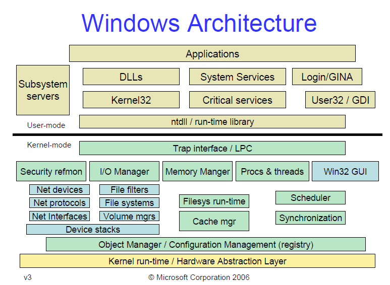

# 恶意代码分析与检测

## Shellcode 定义

Shellcode 是漏洞利用时的有效载荷. 它会完成攻击者期待的行为.

## Shellcode in Windows Platform

### Windows 架构

在 Windows 平台中, 用户空间程序无法直接发出系统调用 (与 Linux 平台存在本质区别). 它们只能利用 Windows API (kernel32.dll 等)提供的接口, 由 Windows API 来调用 Native API (ntdill.dll), 再来发出系统调用. 因此, Native API 即为用户空间最底层的抽象.



因此 Windows 平台的 x86 shellcode 必须利用 Windows API 或者 Native API 完成攻击者期待的行为. 如果我们的目标行为是运行一个给定的可执行文件 (方便演示) 那么我们可以考虑寻找 kernel32.dll 提供的 `WinExec` 函数.

因此, 我们需要定位到内存中 kernel32.dll 的位置, 并查找它提供的 `WinExec` 地址, 并准备合适的参数来调用它.

### 定位 DLL 的基址

我们准备利用进程环境块来定位 DLL. `fs` 段寄存器存储的是线程环境块 (Thread Environment Block, TEB) 的地址, TEB 是每个线程唯一的, 它包含一个指向进程环境块 (Process Environment Block, PEB) 的指针, PEB 的指针为 `[fs + 0x30]`.

PEB 的 0x0C 偏移处包含一个指向 PEB_LDR_DATA 结构的指针. PEB_LDR_DATA 提供了关于载入 DLL 的信息, 它包含 3 个双向链表 (`InLoadOrderModuleList`, `InMemoryOrderModuleList` 和 `InInitializationOrderModuleList`). 它们都包含了 DLLs, 只是顺序不同. 在目前所有的 Windows 版本中, `InMemoryOrderModuleList` 中包含的*第2个和第3个* Dlls 是 `ntdll.dll` 和 `kernel32.dll`. 因此我们可以以如下顺序定位 `kernel32.dll` 在内存中的基地址.

1. 获取 PEB 的地址 `[fs:0x30]`
2. 获取 PEB_LDR_DATA 地址 `[PEB + 0x0C]`
3. 获取 `InMemoryOrderModuleList` 中第一个节点的地址 `[PEB_LDR_DATA + 0x14]`
4. 获取第二个节点的地址 [1st DLL]
5. 获取第三个节点的地址 [2nd DLL]
6. 获取 `kernel32.dll` 的基地址

```assembly
mov eax, [fs:0x30]
mov eax, [eax + 0x0C]
mov eax, [eax + 0x14]
mov eax, [eax]
mov eax, [eax]
mov eax, [eax + 0x10]
```

### 定位函数地址

然后就是在 DLL 文件内部去寻找我们想要的函数. 这需要对 PE 格式的某些部分做解析. 我们知道在 PE 文件的虚拟地址偏移 0x3C 处存放了 PE signature 的 RVA. 因此我们可以定位到 PE signature 为 `base + 0x3E`. IMAGE_OPTIONAL_HEADER 中的 EXPORT TABLE 与 PE signature 之间的相对虚拟地址偏移为 0x78, 因此 EXPORT TABLE 地址为 `sign + 0x78`.

我们取 `[sign+0x78]` 为 IMAGE_EXPORT_DIRECTORY. 就可以知道 `IMAGE_EXPORT_DIRECTORY + 0x14` 为该 DLL 文件导出的函数数量. `IMAGE_EXPORT_DIRECTORY + 0x1C` 为 Address Table 的地址. `IMAGE_EXPORT_DIRECTORY + 0x20` 为 Name Pointer Table 的地址. `IMAGE_EXPORT_DIRECTORY + 0x24` 为 Ordinal Table 的地址. Address Table 是一个数组, 包含了 DLL 所有导出函数的地址. Name Pointer Table也是一个数组，包含了所有导出函数名字字符串的指针. Ordinal Tanle 包含了函数在 Address Table 中的位置, 本质上就是给 Name Pointer Table 和 Address Table 建立了一个映射关系. 假设我们要寻找一个函数 `WinExec`, 我们首先查找 Name Pointer Table, 并设置一个计数器 *i*. 匹配查找 Name 的同时不断递增计数器, 当匹配到字符串 `WinExec` 时, 记录下 *i* 的值, 并利用 Ordinal Table 建立映射关系, 得到函数地址, 即 `address[ordinal[i]]`.

## 检测方案

利用 Libemu 库可以模拟执行 shellcode, 并分析其的行为, 包括调用了哪些 Windows API 等. Libemu 提供了 C 和 Python 的接口, 且 scdbg 工具也是基于 libemu 实现. 我们拟利用 libemu 来模拟执行 Metasploit 中的shellcode 并检测其的行为.
