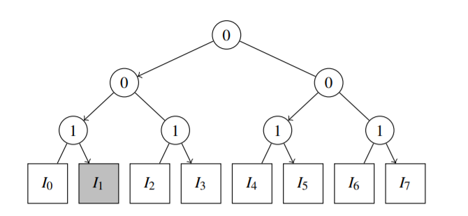
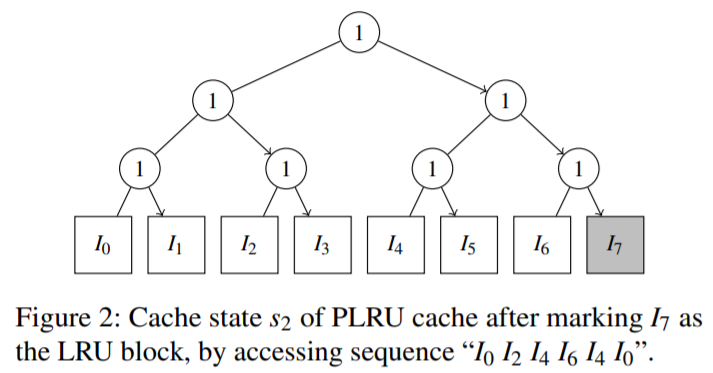
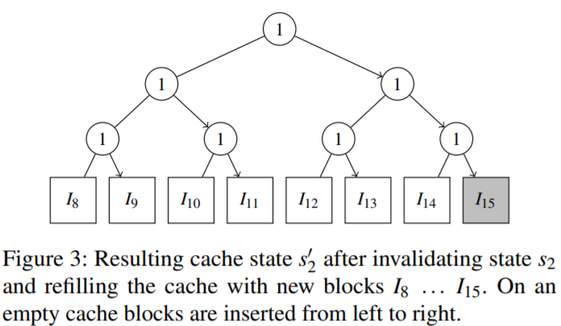

## 摘要
在一些CPU中，**即使cache内容已经被flush**，也会泄露信息。

## 简介
传统cache攻击基于cache内容，然而最新的研究显示能够基于cache的control state进行攻击，即利用cache的替换策略。

由于利用clflush和wbinvd等指令cache flush能够完全清除cache的内容，清除cache的历史记录称为了对抗基于访问cache的攻击的常用手段。

然而，研究表明instruction cache, branch target buffer, branch history table以及 translation lookahead buffer等组件在cache经过flush后仍然保留一些信息，并能够用来影响分支预测器。

本文发现，在某些CPU中，flush无法完全清除cache的相关信息，而即使完全消除了由cache内容带来的信息泄露，也无法阻止通过**元数据**，特别是**cache替换策略的状态**带来的信息泄露。

### 研究假设
- flush操作后，cache的控制状态并未发生改变
- cache中新line的增加不会完全覆盖控制状态

### 验证方案
1. 使用组相关memory block I0, I1, ..., In填充cache set
2. 产生cache hit，使cache控制状态变为已知状态si
3. 通过flush指令使cache内容无效化，并用另一组不同memory block I0‘, I1’, ..., In‘填充cache set，造成状态si'。

若假设成立，则状态si'与之前的状态si相关。  

---
## 验证过程
### 工具
CacheQuery, nanoBench Cache Analyzer

### 识别方案
假设为8路组相连，cache中包含I0-I7 8条cache line。  
1. 访问set号相同的memory line I8
2. 遍历I0-I7，在LRU策略下被排出的cache line为最早访问的。

### 例1 L1’s Tree-based PLRU
排出策略：基于状态树进行排出。图1中0代表指向左子节点，1代表指向右子节点，cache已满时按照指针顺序排出指向的叶子节点，然后插入新的cache line，并将该叶子节点的所有祖先节点取反。

图 1. L1’s Tree-based PLRU

图1为顺序访问I0-I7，然后访问I0-I2-I4-I6后的cache状态。
图中叶子节点以外的中间节点标识了这种状态，因此共有8-1种状态。

1. 访问I0-I7，然后访问I0 I2 I4 I6 I4 I0，可得状态如图2。

2. flush，cache内容清空。
3. 访问I8-I15，**由于此时cache无内容，控制状态不会改变(?)**。此时状态如图3。

4. 在这种状态下，新加入的cache line排出顺序受到之前的cache控制状态影响，会以I15 I11 I13 I9 I14 I10 I12 I8的顺序排出。

### 例2 L2’s Quad-age LRU
......

### 实验结论
Skylake之前的CPU，除了 Nehalem 和 Westmere，都在flush后保留了L1 cache的状态信息。Skylake 和 Coffee Lake之间的处理器保留了L2 cache的状态信息。Cannon Lake 和 Ice Lake等最新的处理器中状态信息**没有**在cache flush后保留。
## 讨论
相较于传统基于cache内容的攻击，本文的方案仅需要访问cache，不需要共享内存，为攻击者提供数据**如何**被访问而非传统的**哪些**数据被访问的信息。
